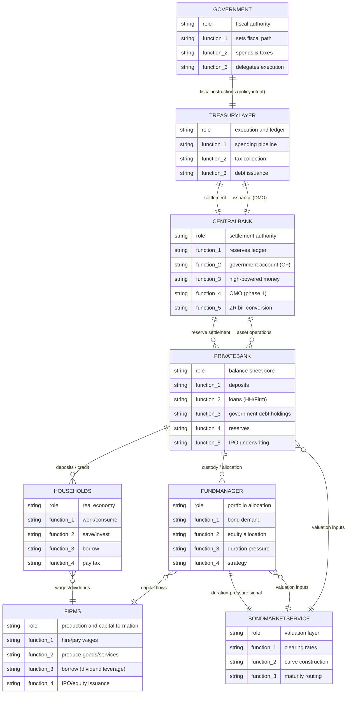

# ABMLP-X Overview

The overview reflects ABMLP-X TreasuryLayer logic, settlement discipline, endogenous policy, financial sector structure, and a dedicated bond valuation layer.

## Entity Relationships

## System Interpretation

ABMLP-X is not organised around markets in the classical sense, but around institutional balance-sheet interactions, settlement-constrained flows, and a dedicated valuation layer.

At its core:

* **The government defines fiscal intent**, but does not execute flows directly.  
* **TreasuryLayer enforces execution discipline**, ensuring all fiscal operations are observable, ordered, and accounting-consistent.  
* **The central bank is the settlement authority**, governing reserves, high-powered money, and system stability.  
* **Bond market service determines valuation conditions**, translating system state into bond pricing inputs.  
* **The private bank is the balance-sheet nexus**, where deposits, loans, and government debt intersect.  
* **Households and firms form the real economy**, generating services, consumption, and credit demand.  
* **The fund manager introduces portfolio behaviour**, emitting a duration-pressure signal rather than directly setting prices.

## Key Structural Features

* **Stock–flow consistency**  
  * All flows (spending, taxation, lending, issuance) resolve through balance-sheet identities.  
* **Settlement precedes valuation**  
  * Transactions succeed or fail based on reserves and accounting constraints. Prices are applied after the system state is realised.  
* **Government debt is endogenous to system flows**  
  * Issuance responds to fiscal pressure and liquidity conditions.  
* **Bond valuation is service-layer driven**  
  * Bond prices are set by a dedicated valuation layer constructs clearing rates from:  
    * central bank base rate  
    * FundManager duration-pressure signal  
    * issuance pressure (next phase)  
    * liquidity and reserve conditions (next phase)  
    * balance-sheet constraints (next phase)  
* **Separation of concerns** (design principle)  
  * Fund Manager emits pressure signal  
  * Bond Market Service determines valuation  
  * Model core updates instrument prices. This prevents behavioural logic from directly overriding system-wide pricing.  
* **Central bank operations** include, but are not limited to:  
  * Open Market Operations (OMO) liquidity backstop (phase 1).  
  * Zero-rate T-bill conversion facility (test regime).

## Conceptual Framing

Rather than a bond market, the system behaves as:

* a liquidity management mechanism  
* a balance-sheet coordination system  
* a monetary–fiscal transmission structure  
* a valuation system driven by institutional constraints

Price movements (yields, spreads) are therefore not purely informational signals. They emerge from the system processing:

* reserve creation (spending)  
* reserve drainage (taxation and issuance)  
* portfolio reallocation (Fund manager behaviour)  
* valuation-layer clearing logic

In this framing, yields are best understood as the system's internal solution to its own balance-sheet pressures.
